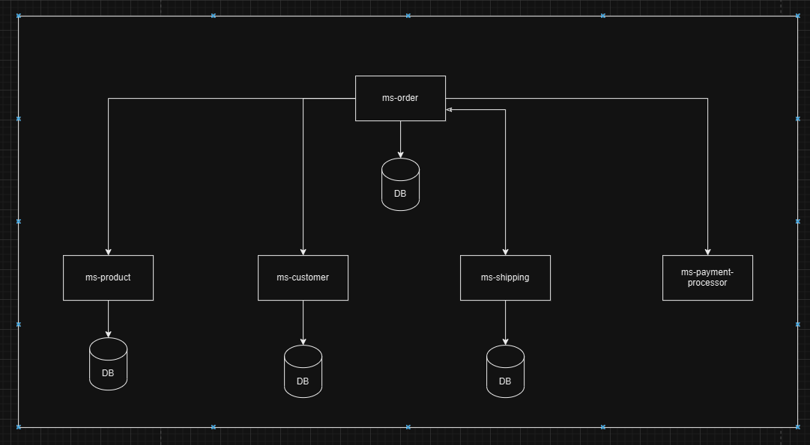

# ORDER-MANAGEMENT-TC-FASE-4

### Desenho da aplicação

### Observações
- Todas as aplicações contém swagger
- Todas as aplicações contém o relatório do JaCoCo (caminho: /target/site/jacoco/index.html)
- Executar a aplicação com o docker-compose localizado na raiz

### Documentação do projeto
https://docs.google.com/document/d/1ZLhqfGAtNP-XBVibTWhl0Mx74cUcUZLdK4ihFVyfKHk/edit?tab=t.0

### Collection
resources/Fase 4.postman_collection.json

### Grupo
- Amanda da Silva Miranda
- Rodrigo de Almeida Muniz
- Vinicius De Lima Gomes
- Gabriel Figueiredo Fernandes Lobão
- Leonardo Padilha Ramos de Souza
